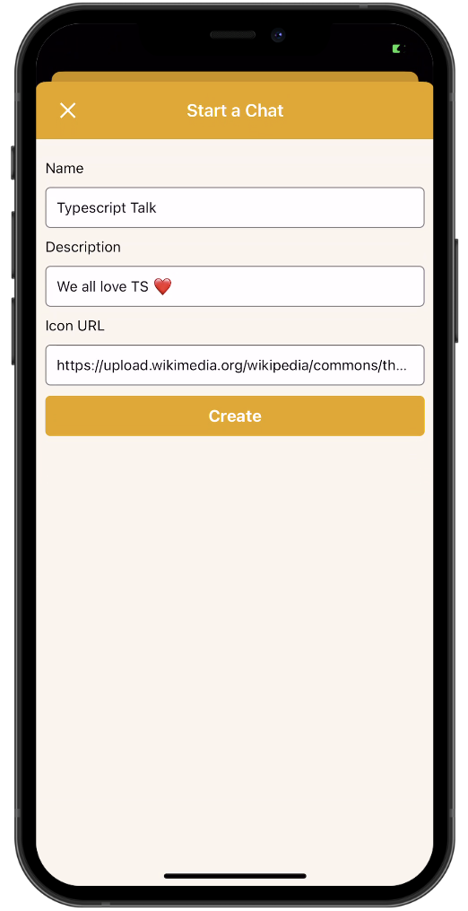

# The Best Realtime React Native Chat (Expo, Typescript, File Upload, Convex)

This is a React Native project using [Expo](https://expo.dev/) and [Convex backend](https://www.convex.dev/).

Features:

- Convex database functions & schema 🚀
- Realtime chat ⚡️
- File upload to Convex 📁
- Expo file-based Router 🛣
- React Native Dialog 📱
- Expo Async Storage 📦
- Typescript ❤️

## Convex Setup

All [Convex](https://www.convex.dev/) related code is in the `convex` folder:

- `convex/groups.ts` - Convex mutations and queries for groups table
- `convex/messages.ts` - Convex mutations and queries for messages table
- `convex/schema.ts` - Convex schema for groups and messages tables
- `convex/http.ts` - Custom endpoint for file upload
- `convex/greetings.ts` - Convex actions example

## App Screenshots

